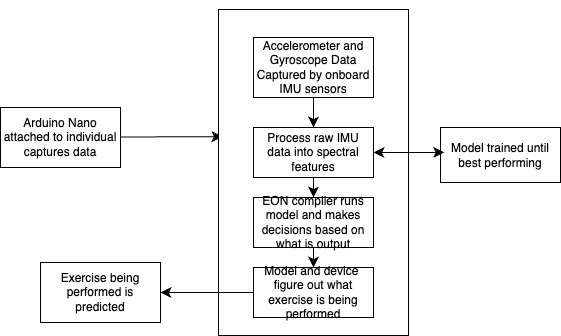
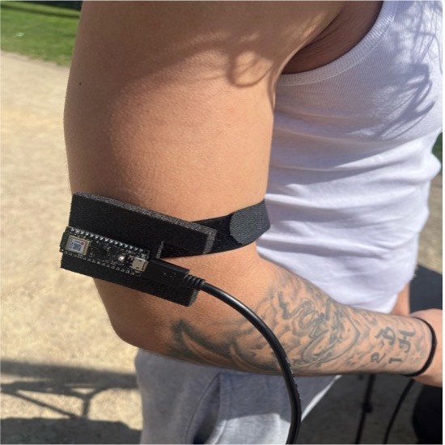
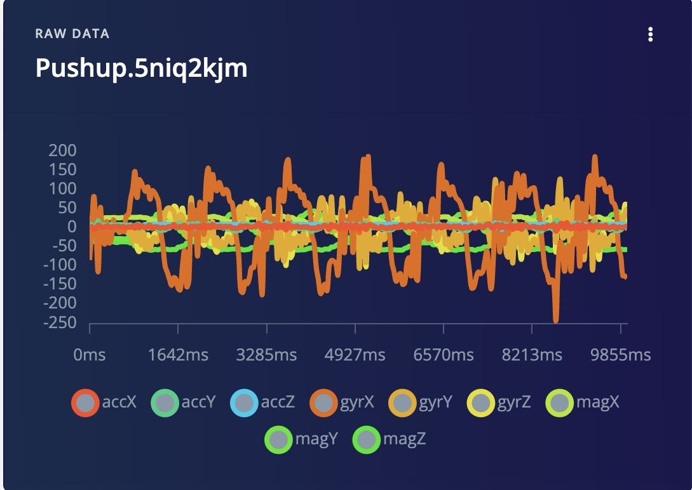
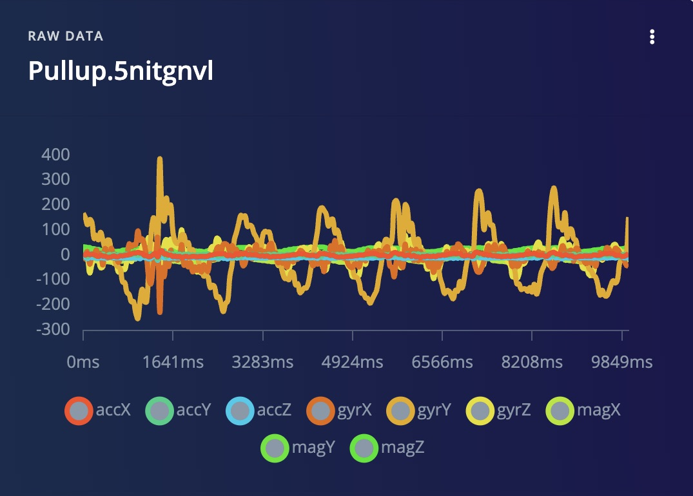
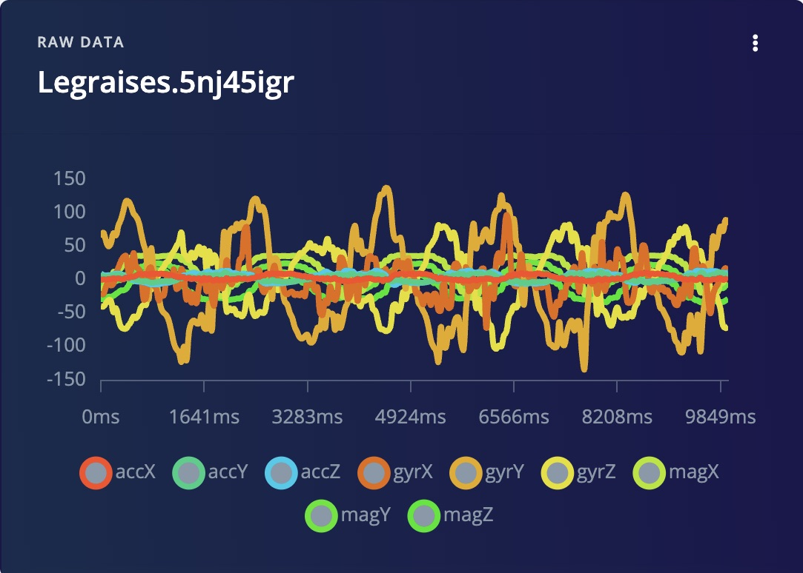
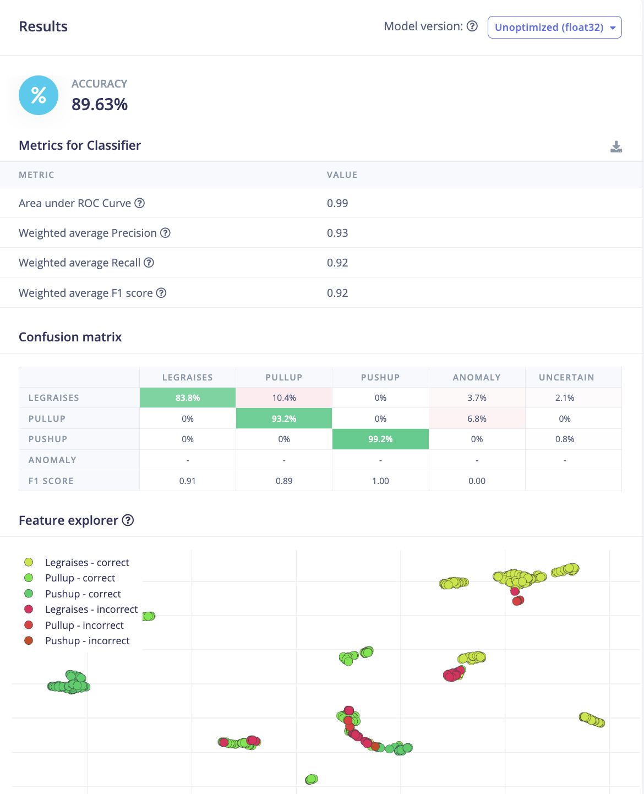
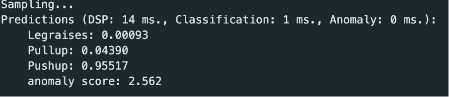
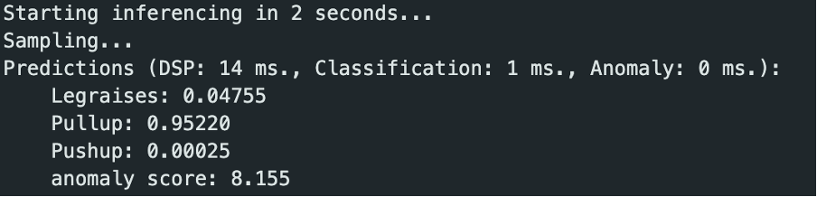
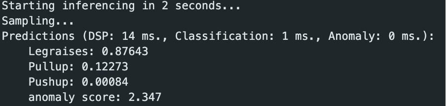

# CalisthenicsCASA0018

## Calisthenics Exercise Deep Learning Model

### Introduction
This project uses three distinct exercises of calisthenics which are pushups, pullups, and leg raises. Then based on motion data acquired through a home-made wearable sensor signals from the accelerometer, gyroscope, and magnetometers are processed and spectral features extracted, along with labeling of exercise as a light-weight neural network using Edge Impulse training.

## Motivation
Most movement classification samples available online are interested in simple gestures or light exercises. I wanted to explore a more demanding, real-world scenario by finding full-body calisthenics exercises, where motion patterns are more complex and fatigue affects movement quality. 

## Development 

### Application Overview

### Prototype of Wearable Device

### Raw Data Examples

### Final Model Testing

### Arduino Deployment

